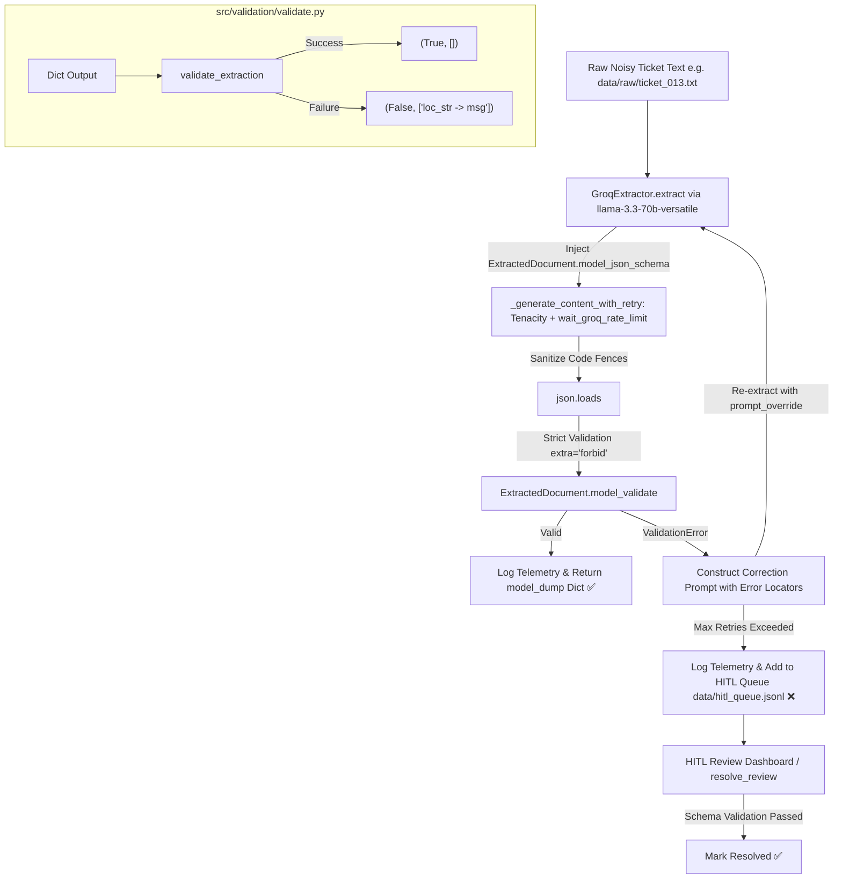

# BRAIN.md — Single Source of Truth for `structured-extract` & `Cleanroom`

> **Document Status**: Canonical / Active Single Source of Truth  
> **Last Updated**: July 2026 (Consolidated Production Pipeline — Groq/LLaMA Provider)  
> **Target Audience**: Future AI Agents, Senior Software Engineers, DevOps Engineers, and System Architects.

---

## 1. Executive Summary & Consolidated Architecture

The **Cleanroom Structured Extraction System** (`structured-extract`) is a unified Python document extraction and validation pipeline designed to ingest noisy, unstructured, and messy real-world document samples (such as customer support tickets, contracts, live chat transcripts, and forwarded email threads) and transform them into strictly validated, structured JSON objects conforming to the single canonical Pydantic schema: `ExtractedDocument`.

### Architectural Consolidation Milestones
1. **Single Canonical Schema (`ExtractedDocument`)**: All dual-schema divergence has been eliminated. The legacy `SupportTicketExtraction` schema (`src/schemas.py`) was deleted. The system now uses `ExtractedDocument` (`data/schema/schema.py`) across all extraction, validation, and testing layers.
2. **Unified Extraction Engine (`GroqExtractor`)**: Located in `src/extractor.py`, `GroqExtractor` uses the Groq Cloud API with `llama-3.3-70b-versatile` (`GROQ_MODEL`), loads API credentials from `.env` (`GROQ_API_KEY`), dynamically injects `ExtractedDocument.model_json_schema()` directly into prompts, and implements robust network/API retry logic via `tenacity` with a custom `wait_groq_rate_limit` strategy that parses exact `retry-after` durations from HTTP 429 errors.
3. **Self-Correcting Extraction Pipeline (`src/extraction/pipeline.py`)**: Implements `extract_with_repair()` — an iterative validation-feedback loop that catches Pydantic `ValidationError`s, constructs correction prompts with exact error locators, and re-queries the LLM to self-correct up to `max_retries` attempts.
4. **Prototype Isolation (`prototype/app.py`)**: The legacy monolithic prototype (`app.py`) has been moved out of the workspace root into `/prototype/app.py` and marked with `# Initial prototype - superseded by src/ pipeline, kept for reference.`
5. **Synthetic Benchmarking Ecosystem**: Includes `src/eval/generate_samples.py` which generates a high-fidelity dataset of 55 messy tickets (`data/raw/ticket_001.txt` to `ticket_055.txt`) and `manifest.json`.
6. **Batch Evaluation Harness (`src/eval/run_eval.py`)**: Processes all 55 tickets through `extract_with_repair()`, computes summary metrics (success rate, attempt distribution, error categorization), saves results to `eval/results/`. Supports `--resume` for incremental runs.
7. **Interactive Demo (`demo/app.py`)**: Streamlit UI for live extraction with self-correction visualization and pipeline stats sidebar.

---

## 2. Complete Workspace Folder Structure

```
Cleanroom/
├── prototype/
│   └── app.py                     # [Legacy Prototype] Kept for historical reference only
└── structured-extract/            # [Production Pipeline Root]
    ├── .env                       # Active environment configuration (GROQ_API_KEY, GROQ_MODEL)
    ├── .env.example               # Example environment variables template
    ├── BRAIN.md                   # Canonical technical reverse-engineering reference (this document)
    ├── README.md                  # Project overview and basic setup instructions
    ├── requirements.txt           # Python dependencies (pydantic>=2.0, jsonschema, groq, tenacity, streamlit, python-dotenv, pytest)
    ├── data/
    │   ├── raw/                   # Benchmark dataset: 55 noisy ticket samples (ticket_001.txt..055.txt) + manifest.json
    │   │   ├── manifest.json      # Mapping of each filename to its diagnostic noise/failure mode summary
    │   │   ├── ticket_001.txt ... ticket_055.txt
    │   │   └── .gitkeep
    │   └── schema/
    │       ├── __init__.py
    │       └── schema.py          # Single canonical schema: ExtractedDocument (StrictBaseModel, extra="forbid")
    ├── demo/
    │   └── app.py                 # Streamlit interactive extraction demo (Live Extraction & HITL Review Dashboard tabs)
    ├── eval/
    │   └── results/               # Evaluation metrics: eval_results.json (per-ticket) and eval_summary.json
    ├── logs/
    │   ├── extraction.log         # Rotating log file for extraction pipeline events
    │   └── audit_telemetry.jsonl  # Structured JSON audit telemetry for every extraction run (timestamp, latency_ms, status, attempts)
    ├── report/                    # Directory reserved for generated assessment reports (.gitkeep)
    ├── src/
    │   ├── __init__.py
    │   ├── extractor.py           # GroqExtractor class using llama-3.3-70b-versatile + ExtractedDocument + tenacity retry logic
    │   ├── eval/
    │   │   ├── __init__.py
    │   │   ├── generate_samples.py # Hybrid API / local fallback dataset generator
    │   │   └── run_eval.py        # Batch evaluation harness across all 55 tickets with --resume support
    │   ├── extraction/
    │   │   ├── __init__.py
    │   │   ├── pipeline.py        # extract_with_repair() — self-correcting extraction loop with HITL queueing & telemetry
    │   │   └── test_pipeline.py   # Pytest unit tests for the self-correction pipeline
    │   ├── hitl/
    │   │   ├── __init__.py
    │   │   ├── queue.py           # Persistent JSONL review queue management and schema-validated human resolution
    │   │   └── test_queue.py      # Pytest unit tests for HITL queue add, resolve, and dismiss operations
    │   └── validation/
    │       ├── __init__.py
    │       ├── validate.py        # validate_extraction() wrapper returning (bool, list[str]) using ExtractedDocument
    │       └── test_validate.py   # Pytest unit tests for ExtractedDocument validation
    └── venv/                      # Local Python 3.12 virtual environment
```

---

## 3. Core Components & Module Specifications

### 3.1. Canonical Schema: `data/schema/schema.py` (`ExtractedDocument`)
The single Pydantic v2 domain model used across the entire pipeline.
- **Strict Structural Enforcement**: Inherits from `StrictBaseModel` with `model_config = ConfigDict(extra="forbid")`. Any extra fields or unmapped keys returned by the LLM result in an immediate `ValidationError`.
- **Enums**:
  - `AccountTier`: `free`, `pro`, `enterprise`
  - `IssueCategory`: `billing`, `technical`, `account`, `other`
  - `IssuePriority`: `low`, `medium`, `high`, `urgent`
  - `ResolutionStatus`: `open`, `in_progress`, `resolved`, `escalated`
- **Model Hierarchy**:
  - `Customer`: `name` (str, required), `email` (Optional[str]), `account_tier` (Optional[AccountTier])
  - `Issue`: `category` (IssueCategory, required), `summary` (str, required), `priority` (Optional[IssuePriority])
  - `Resolution`: `status` (ResolutionStatus, required), `resolution_notes` (Optional[str]), `assigned_agent` (Optional[str])
  - `Metadata`: `created_at` (Optional[str]), `tags` (List[str], default empty list)
  - `ExtractedDocument` (Root): `ticket_id` (Optional[str]), `customer` (Customer), `issue` (Issue), `resolution` (Resolution), `metadata` (Metadata)

---

### 3.2. Extraction Engine: `src/extractor.py` (`GroqExtractor`)
- **Initialization**:
  - Loads environment variables from `.env`.
  - Initializes `self.client = Groq(api_key=os.getenv("GROQ_API_KEY"))`.
  - Sets `self.model_name = os.getenv("GROQ_MODEL", "llama-3.3-70b-versatile")`.
  - Sets `self.schema_class = ExtractedDocument`.
- **API Call & Retry Logic (`_generate_content_with_retry`)**:
  - Decorated with `@retry(stop=stop_after_attempt(3), wait=wait_groq_rate_limit(fallback_wait=60.0), reraise=True)` from `tenacity`.
  - Uses `self.client.chat.completions.create()` with a system prompt enforcing JSON-only output and a user prompt containing the schema and raw text.
  - On HTTP 429 errors, `wait_groq_rate_limit` parses exact `retry-after` duration from response headers or error message strings (e.g., `"Please try again in 56.15s"`) and waits precisely that long plus a 1s safety buffer. Falls back to 60s if unparseable.
- **Extraction Flow (`extract(text) -> Dict[str, Any]`)**:
  1. Programmatically injects `ExtractedDocument.model_json_schema()` into the extraction prompt.
  2. Invokes `_generate_content_with_retry(prompt)`.
  3. Sanitizes markdown fences (`clean_text.strip("```json").strip("```")`).
  4. Parses JSON and performs strict structural validation (`self.schema_class.model_validate(raw_json)`).
  5. Returns `validated.model_dump()`. Validation errors happen outside `@retry` so schema violations fail immediately without wasting API retries (ready for the downstream self-repair loop).

---

### 3.3. Self-Correcting Pipeline: `src/extraction/pipeline.py` (`extract_with_repair`)
- **Flow**: `Raw Text` → `GroqExtractor` (tenacity retry) → `Pydantic Validate` → `(If fail)` → `Correction Prompt` → `Retry Repair Loop`.
- **Success Path**: Records telemetry (`logs/audit_telemetry.jsonl`) and returns `{"status": "success", "attempts": N, "errors_encountered": [], "data": {...}}`.
- **Repair Path**: Constructs correction prompts containing original text, invalid JSON, exact Pydantic error locators, and schema structure. Re-calls extractor with `prompt_override`.
- **Failure Path**: After `max_retries`, automatically adds the item to the HITL review queue via `add_to_review_queue()`, logs telemetry, and returns `{"status": "flagged_for_review", "attempts": N, "last_errors": [...], "raw_text": "...", "last_attempt_json": {...}, "queue_id": "Q-..."}`.
- **Error Separation**: API/Network errors (429, timeouts) use tenacity retries. Validation errors (Pydantic) use the repair loop budget. These are fully independent.

---

### 3.4. Validation Suite: `src/validation/validate.py` & `test_validate.py`
- `validate_extraction(json_obj: Dict[Any, Any]) -> Tuple[bool, List[str]]`: Wraps `ExtractedDocument.model_validate(json_obj)`. On success returns `(True, [])`. On failure formats each `ValidationError` into a clean locator string (`"loc_str: msg"`, e.g., `"customer -> account_tier: Input should be 'free', 'pro' or 'enterprise'"`), returning `(False, errors)`.
- `test_validate.py`: Pytest suite covering valid extractions, invalid enum rejection, and missing required field detection.

---

### 3.5. Human-In-The-Loop (HITL) Queue & Telemetry: `src/hitl/queue.py`
- **Queue Storage (`data/hitl_queue.jsonl`)**: Persists items flagged for review with their `queue_id`, `ticket_id`, `status` (`pending_review`, `resolved`, `dismissed`), `created_at`, `attempts_taken`, `raw_text`, `last_attempt_json`, and `last_errors`.
- **Schema-Validated Resolution (`resolve_review`)**: Allows human reviewers or automated repair tools to submit corrected JSON dictionaries. Before marking an item `resolved`, `resolve_review()` validates the submitted JSON against `ExtractedDocument`. If validation fails, the item remains `pending_review` and returns exact error locators.
- **Audit Telemetry (`logs/audit_telemetry.jsonl`)**: Every extraction attempt records structured JSON entries tracking exact `timestamp`, `status` (`success` / `flagged_for_review`), `attempts`, `latency_ms`, `error_count`, `model`, and `queue_id`.

---

### 3.6. Benchmark Dataset Generator: `src/eval/generate_samples.py`
- Generates `data/raw/ticket_001.txt` through `ticket_055.txt` along with `manifest.json`.
- Uses a built-in fallback dataset of 55 pre-crafted high-fidelity noisy tuples covering diverse failure modes (typos, ALL CAPS, code-switching, category ambiguity, corporate/free-tier tones).

---

### 3.7. Evaluation Harness: `src/eval/run_eval.py`
- Processes all 55 tickets through `extract_with_repair()` using `GroqExtractor`.
- Computes and prints summary metrics: success rate, attempt distribution, error categorization, flagged tickets.
- Saves `eval/results/eval_results.json` (per-ticket) and `eval/results/eval_summary.json`.
- Supports `--resume` flag for incremental/interrupted runs with automatic checkpoint recovery.
- Includes 4-second proactive delay between tickets to stay within rate limits.

---

## 4. End-to-End Consolidated Workflow



---

## 5. Operational Commands & Developer Reference

Run all commands inside the `structured-extract/` workspace root with the virtual environment active:

```powershell
# 1. Activate Virtual Environment
.\venv\Scripts\Activate.ps1

# 2. Sync / Install Dependencies
pip install -r requirements.txt

# 3. Run Complete Unit Test Suite (11 tests across validation, extraction, and HITL)
.\venv\Scripts\pytest.exe -v src/validation/test_validate.py src/extraction/test_pipeline.py src/hitl/test_queue.py

# 4. Regenerate Benchmark Tickets & manifest.json
python src/eval/generate_samples.py

# 5. Run Batch Evaluation Harness (all 55 tickets)
python src/eval/run_eval.py

# 6. Resume an interrupted evaluation run
python src/eval/run_eval.py --resume

# 7. Launch Interactive Streamlit Demo (Live Extraction + HITL Dashboard)
.\venv\Scripts\streamlit.exe run demo/app.py
```

---

## 6. Latest Evaluation Results (Groq / llama-3.3-70b-versatile)

- **Total Tickets Processed**: 55
- **Schema-Valid Success Rate**: **100.00%** ✅ (exceeds >90% target)
- **Attempt 1 (Direct Success)**: 52 tickets
- **Attempt 2 (Self-Corrected)**: 3 tickets
- **Attempt 3 (Self-Corrected)**: 0 tickets
- **Flagged for Review**: 0 tickets
- **Total API Calls**: 58
- **Run Time**: ~5.23 minutes (with 4s inter-ticket delay)

---

## 7. Next Steps Checklist for AI Agents

With the project successfully consolidated into a single schema (`ExtractedDocument`) and single extraction engine (`GroqExtractor` with `tenacity`), and with the self-correcting pipeline and batch evaluation achieving 100% success:
1. **Observability & HITL**: **[DONE]** Added structured audit telemetry (`logs/audit_telemetry.jsonl`) recording latency, attempts, model, and status. Built persistent HITL queue (`src/hitl/queue.py` & `data/hitl_queue.jsonl`) with schema-validated resolution, fully integrated into both `extract_with_repair()` and the interactive Streamlit dashboard (`demo/app.py`).
2. **Deployment / Demo**: Deploy the Streamlit app (`demo/app.py`) to a cloud hosting platform (e.g. Streamlit Community Cloud, Fly.io, or Render).
3. **CI/CD Pipeline**: Add automated testing and evaluation harness to a GitHub Actions CI workflow.
